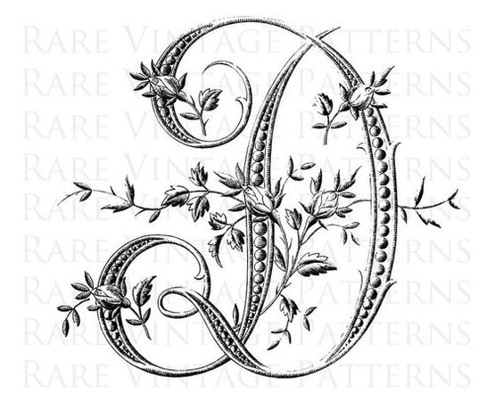
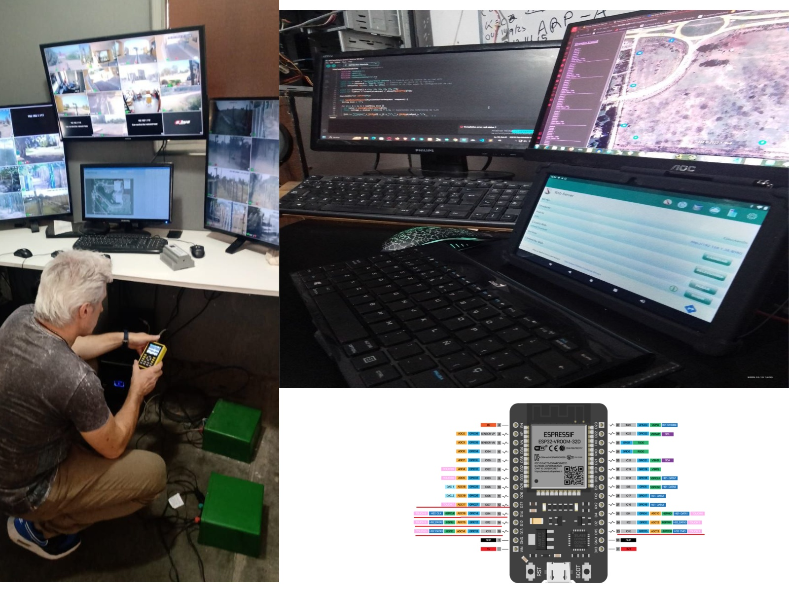

# dardo_bagnis
#  Hola! Mi nombre es Dardo David Bagnis

**Tecnico en electronica, Informática y telecomunicaciones ** 💻 

Especialmente interesado en el desarrollo, instalacion y mantenimiento de harware y software de disppositivos IOT embebidos.

## Contacto

))

)]

 
## ⚡ Tecnologías más usadas

ESP8266, ESP32, HB100, RCWL1605, DHT11
### 🚀 Lenguajes

## 📈 Trabajando en...

